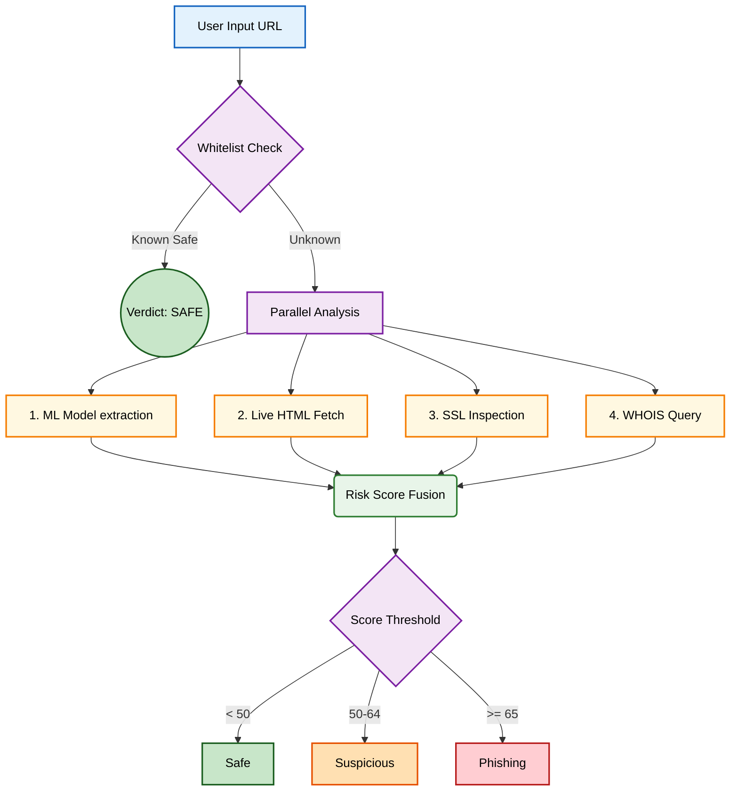

# 🛡️ Phishing Detector

An explainable, machine-learning-based system for real-time detection of phishing and malicious URLs. 

Phishing Detector moves beyond traditional, reactive blacklists by evaluating the structural, behavioral, and infrastructural characteristics of a website in real time. Built with an XGBoost classifier and a live four-signal analysis engine, the system delivers highly accurate verdicts (**Safe**, **Suspicious**, or **Phishing**) along with a plain-language explanation of why a URL was flagged.

## 🚀 Core Innovation

Instead of relying on a single model score, this system uses a hybrid ensemble approach. An ML model evaluates the URL string, while three independent concurrent workers inspect the live website.

The final risk score is a weighted fusion of four signals:

| 🚥 Signal | ⚖️ Weight | 🔍 What it analyzes |
|:---|:---:|:---|
| **🧠 Machine Learning Model** | **40%** | An XGBoost classifier trained on over 650,000 labeled URLs. It evaluates 26 structural features of the URL itself, such as length, character distribution, and suspicious keywords. |
| **📄 Live Page Content** | **25%** | Fetches the live webpage and analyzes its HTML for deceptive practices, such as external form submissions, hidden iframes, and excessive redirects. |
| **🔒 SSL Certificate** | **20%** | The site's TLS certificate is evaluated for issuer trust, domain mismatch, and issuance age. |
| **🌐 Domain Age** | **15%** | Queries the WHOIS registration record, targeting short-lived domains commonly used in phishing campaigns. |

## ✨ Key Features

- **Explainable AI**: The system doesn't just output a risk score. It provides a signal-by-signal breakdown with human-readable flags, making the decision process transparent to non-technical users.
- **Resilient Batch Processing**: Organizations can upload CSV files containing thousands of URLs. The system processes them concurrently and maintains state, allowing for pauses and resumptions without data loss.
- **Analytics Dashboard**: A built-in visualization suite tracks scan history, verdict distributions, risk score histograms, and dynamic feature importance charts.
- **Dynamic 3D Interface**: The frontend is designed with a modern, responsive glassmorphism UI, featuring interactive metric cards, animated progress indicators, and live website screenshot previews.

## 🏗️ Architecture

The system is designed for speed and modularity. The pipeline allows the heavy network-bound live checks to run concurrently while the ML model processes the URL instantly.

## ☁️ Deployment

The application is fully containerized and compatible with Streamlit Cloud. The GitHub repository is structured so that it can be deployed directly by pointing Streamlit Community Cloud to the root entry point.

## 👤 Author

Designed and developed by **Naman Dugar**.
